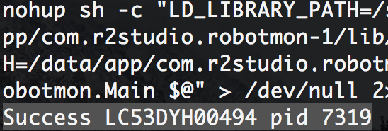

# Robotmon Desktop
<a href='https://sites.google.com/view/robotmon'></a>

## Installation

if you're on Windows:
```
npm install --global --production windows-build-tools
```

## Quick Start

```
git clone https://github.com/r2-studio/robotmon-desktop.git
cd app
npm install
./node_modules/.bin/electron-rebuild
npm start
```

## Install Robotmon App

* Only support Android
* No need to root
* Download on [Google Play](https://play.google.com/store/apps/details?id=com.r2studio.robotmon).

<a href='https://play.google.com/store/apps/details?id=com.r2studio.robotmon'></a>

## Run Robotmon Service (Important)

1. Enable USB Debugging on your phone
2. Connect your phone to your computer over a USB cable
3. Enable the service by using Robotmon Service Manager or Robotmon Desktop or CLI

### Using Robotmon Service Manager 

1. Download [Robotmon-service-manager](https://github.com/r2-studio/robotmon-desktop/raw/master/service-manager/service-manager.zip) and unzip it
2. In the bin directory, open the folder that matches your operation system
3. Double click start to enable the service. A successful start would show message as below: 



### Using Robotmon Desktop

1. Click `掃描 Scan`
2. Click `啟動 Start`

### Using CLI

```
adb shell 'nohup sh -c "LD_LIBRARY_PATH=/system/lib:/data/app/com.r2studio.robotmon-1/lib/arm:/data/app/com.r2studio.robotmon-2/lib/arm CLASSPATH=/data/app/com.r2studio.robotmon-1/base.apk:/data/app/com.r2studio.robotmon-2/base.apk app_process32 /system/bin com.r2studio.robotmon.Main $@" > /dev/null 2> /dev/null &'
```

## Check Robotmon Service is running

```
$ adb shell 'ps | grep app_process'
shell     16035 16032 2295692 40508 futex_wait ab35c858 S app_process32
```

## Kill Robotmon Service

```
# find pid
adb shell ps app_process
# or
adb shell 'ps | grep app_process'

# kill it
adb shell kill <pid>
```

## Troubling

* Check `LD_LIBRARY_PATH`, `CLASSPATH`, and `app_process32` is correct/exists
* Thers is no `nohub` in some devices, you may remove it and try again
* Using `app_process` instead of `app_process32` in old phones

## Verified on the following phones

|Brand|Model|
|---|---|
|HTC|U11, 10, X9, A9, E9+, M9, Eye, Butterfly 2, Butterfly|
|Samsung|Note 8, S7|
|Asus|ZenFone 2|
|OnePlus|3T|
|Emulator|Nox App Player, BlueStacks|

## Explore the Robotmon JavaScript APIs
Learn more about Robotmon APIs on [robotmon-scripts](https://github.com/r2-studio/robotmon-scripts) repository.