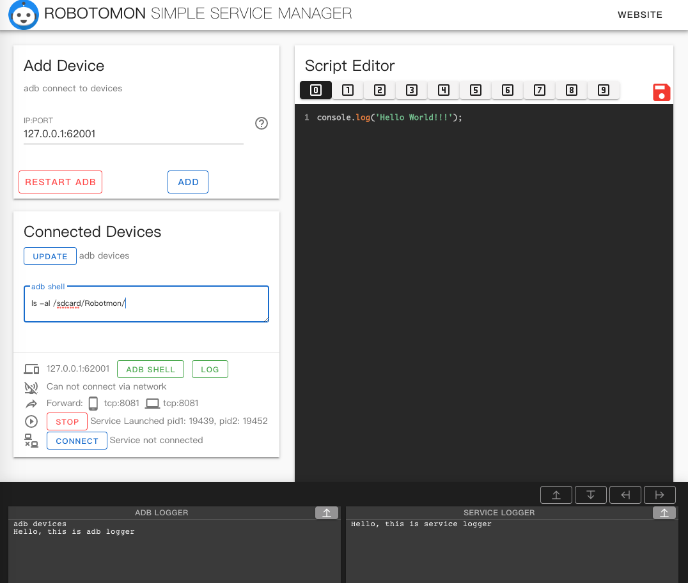
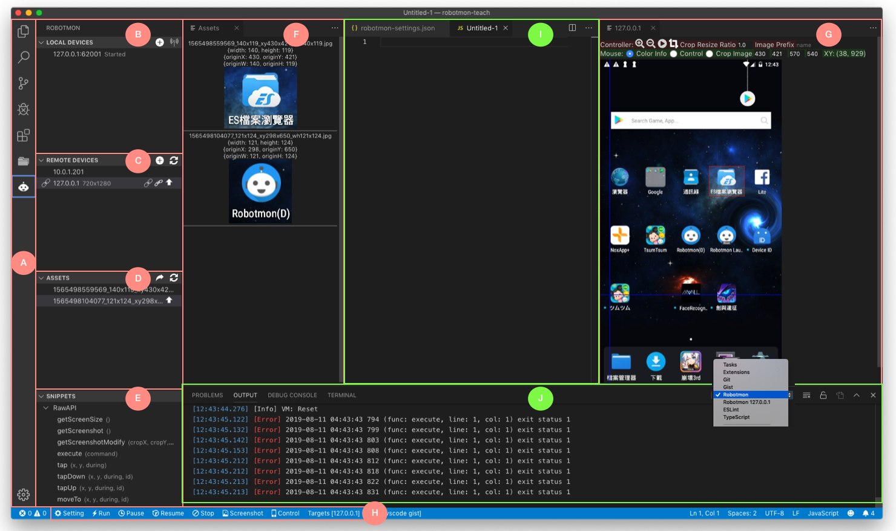

# Robotmon Desktop

This project aim to provide Robotmon helper tools for user and developer.

For User:

* [SimpleManager](https://github.com/r2-studio/robotmon-desktop/tree/master/simple-manager)
* [ChromeMessenger](https://github.com/r2-studio/robotmon-desktop/tree/master/chrome-messenger)

For Developer:

* [EditorVSCode](https://github.com/r2-studio/robotmon-desktop/tree/master/editor-vscode)

Another old version: (discarded)

* ide-v1 electron version
* ide-v2 react+electron version
* launcher-v1 double click executable version
* launcher-v2 has UI, go-astilectron version (most user used)
* launcher-v3 command line UI, light version

## SimpleManager (USER)

## EditorVSCode (DEVELOPER)

